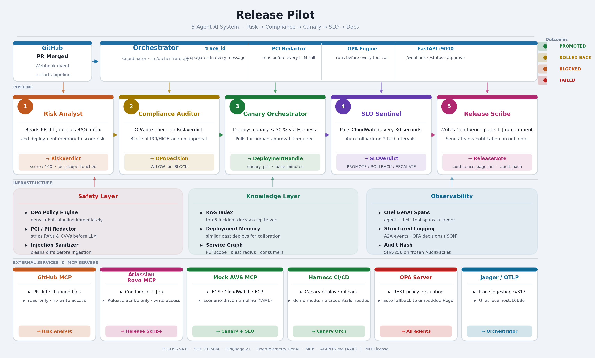

# Release Pilot

Release Pilot is a 5-agent AI system that takes over the moment a pull request is merged and owns the dangerous last mile of the software delivery lifecycle: it assesses deployment risk against RAG-augmented historical incidents, enforces PCI-DSS and SOX compliance policy via OPA, orchestrates a canary rollout through Harness, monitors SLOs in real time and rolls back automatically on breach, then produces a frozen audit packet and a Confluence release page — all without human intervention unless the risk profile demands it. The demo ships with two placeholder services (**ServiceA**, a PCI-scoped payment processor, and **ServiceB**, a non-PCI notification service); any team can swap these out via `config/service_graph.json`.

---

## Features

| Capability | Detail |
|-----------|--------|
| **5-agent pipeline** | Risk Analyst → Compliance Auditor → Canary Orchestrator → SLO Sentinel → Release Scribe, each with a least-privilege tool set |
| **3-component safety layer** | PCI/PII Redactor (Luhn-validated PAN detection) · Prompt-Injection Sanitizer · OPA Policy Engine (embedded fallback — no server required) |
| **Real-time web dashboard** | FastAPI + vanilla-JS WebSocket UI on port 9100; 5 agent cards, safety strip, live event log, Confluence preview, approval button |
| **Live Confluence publishing** | Set `INTEGRATION_CONFLUENCE_MODE=live` to publish real pages via Confluence Cloud REST API v2; falls back to local Markdown on any failure |
| **Live GitHub PR diffs** | Set `INTEGRATION_GITHUB_MODE=live` to fetch real PR diffs from the GitHub REST API; falls back to fixture diff on any failure |
| **Live AWS CloudWatch** | Set `INTEGRATION_AWS_MODE=live` for real SLO metrics via boto3; sandbox-scoped + dry-run by default; falls back to mock on any error |
| **Live Harness pipelines** | Set `INTEGRATION_HARNESS_MODE=live` for real pipeline execution via Harness REST API; sandbox-scoped, OPA-gated, `SAFETY_ALLOW_LIVE_DEPLOYS=false` dry-run by default |
| **Frozen audit trail** | `AuditPacket` is a frozen Pydantic model; SHA-256 `audit_trail_hash` computed at attestation time and embedded in every Confluence page |
| **OpenTelemetry tracing** | GenAI spans for every agent invocation, LLM call, and tool call; `trace_id` propagated through every A2A message |

---

## Architecture

```
PR merged → Webhook (port 9000)
                │
        ┌───────▼────────────────────────────────────────┐
        │               Orchestrator                       │
        │  trace_id propagated through every A2A message  │
        └──┬──────────┬──────────┬──────────┬────────────┘
           │          │          │          │          │
       Risk       Canary      SLO      Compliance  Release
      Analyst    Orchestr.  Sentinel   Auditor     Scribe
        [1]        [3]        [4]        [2,5]       [5]
```

The system is built in seven layers:

| Layer | What it does |
|-------|-------------|
| **Orchestrator** | Thin A2A coordinator; emits structured JSON envelopes; propagates `trace_id` |
| **Agent layer** | Five single-purpose agents, each with a least-privilege tool set |
| **OPA Policy Engine** | Evaluates `policies/release_guardrails.rego` before every tool call; embedded fallback when server is down |
| **PCI/PII Redactor** | Strips card numbers, CVVs, and emails before every LLM call — no exceptions |
| **Prompt Injection Sanitizer** | Cleans diff bodies of injection attempts before LLM ingestion |
| **Knowledge layer** | sqlite-vec RAG index + deployment memory; seeded from `docs/` or your own docs |
| **Observability** | OpenTelemetry GenAI spans → Jaeger (OTLP gRPC, port 4317) |



---

## Folder Structure

```
release-pilot/
├── .env.example              # Credential template — copy to .env and fill in
├── .github/
│   ├── agents/               # Agent definition files (Copilot 2026 .agent.md spec)
│   └── workflows/ci.yml      # GitHub Actions CI — runs full test suite on every push
├── config/
│   ├── __init__.py
│   ├── integrations.py       # Single source of truth for INTEGRATION_*_MODE flags
│   └── service_graph.json    # Service topology: PCI scope, blast radius, consumers
├── demo_runner.py            # Rich CLI — runs any scenario YAML end-to-end
├── docker-compose.yaml       # Jaeger + OPA + Mock AWS — one command demo environment
├── Dockerfile                # Image for the Mock AWS service
├── docs/
│   └── architecture.png      # System architecture diagram
├── mcp-config.yaml           # MCP server manifest (GitHub, Atlassian, Mock AWS)
├── policies/
│   └── release_guardrails.rego  # OPA Rego v1 policy — the single source of truth
├── requirements.txt          # Python dependencies (pinned to minimum versions)
├── scenarios/                # YAML scenario files that drive the demo and mock AWS
├── scripts/
│   ├── check_confluence.py   # Standalone Confluence credential verifier
│   └── check_github.py       # Standalone GitHub credential verifier
├── src/
│   ├── agents/               # Five agent implementations (one module each)
│   ├── dashboard/
│   │   ├── server.py         # FastAPI dashboard server (port 9100, WebSocket streaming)
│   │   └── static/
│   │       └── index.html    # Single-file dashboard (HTML + CSS + vanilla JS)
│   ├── knowledge/            # RAG index, deployment memory, service graph loader
│   ├── orchestrator.py       # Orchestrator + FastAPI webhook server (port 9000)
│   ├── opa_client.py         # OPA client (live server + embedded Rego fallback)
│   ├── redactor.py           # PCI/PII redactor (Luhn-validated PAN detection)
│   ├── sanitizer.py          # Prompt injection sanitizer
│   ├── telemetry.py          # OpenTelemetry setup and span helpers
│   └── tools/                # External service clients (Harness, Mock AWS, Teams)
├── start_demo.sh             # One-command demo environment startup (launches dashboard)
├── STATUS.md                 # End-to-end component status report
└── tests/                    # pytest suite — 63 tests, 0 failures
```

---

## Prerequisites

| Requirement | Version | Notes |
|-------------|---------|-------|
| Python | 3.11+ | 3.11 recommended; 3.12+ works |
| Docker + Docker Compose | 24+ | Required for `start_demo.sh` (Jaeger, OPA, Mock AWS) |
| Node.js | 18+ | Required only if you run live MCP servers via `npx` |
| OpenAI-compatible API | — | **Live mode only.** Demo runs fully on mocks without this. |
| GitHub token | — | **Live mode only.** Falls back to synthetic PR diff without it. |
| Atlassian API token | — | **Live mode only.** Falls back to local Markdown output without it. |

> **The demo runs fully on mocks and embedded fallbacks.** The only credential required to run `demo_runner.py` against a real LLM is `OPENAI_API_KEY`. Everything else (Harness, OPA, Mock AWS, GitHub diff, Confluence publish) works without credentials.

---

## Setup & Installation

1. **Clone the repository**

   ```bash
   git clone https://github.com/<USERNAME>/release-pilot.git
   cd release-pilot
   ```

2. **Create and activate a virtual environment**

   ```bash
   python3.11 -m venv .venv
   source .venv/bin/activate      # macOS / Linux
   # .venv\Scripts\activate       # Windows
   ```

3. **Install Python dependencies**

   ```bash
   pip install -r requirements.txt
   ```

4. **Copy the credential template**

   ```bash
   cp .env.example .env
   ```

5. **Fill in credentials** — open `.env` and set at minimum:

   ```
   OPENAI_API_KEY=sk-...        # required for live LLM calls
   ```

   All other values have working defaults for demo mode. See [Environment Configuration](#environment-configuration) for the full table.

6. **Start the demo environment** (Jaeger + OPA + Mock AWS + knowledge seeding + dashboard)

   ```bash
   ./start_demo.sh
   ```

---

## Environment Configuration

All env vars the code reads today, grouped by subsystem. Variables marked **No** in "Required for live?" have working defaults and the demo runs without them.

### Integration modes

| Variable | Values | Default | Purpose |
|----------|--------|---------|---------|
| `INTEGRATION_CONFLUENCE_MODE` | `mock` \| `live` | `mock` | Enable real Confluence REST API publishing |
| `INTEGRATION_GITHUB_MODE` | `mock` \| `live` | `mock` | Enable real GitHub REST API diff fetch |
| `INTEGRATION_AWS_MODE` | `mock` \| `live` | `mock` | Enable real CloudWatch metrics for SLO Sentinel |
| `INTEGRATION_HARNESS_MODE` | `mock` \| `live` | `mock` | Enable real Harness pipeline execution |
| `SAFETY_ALLOW_LIVE_DEPLOYS` | `false` \| `true` | `false` | When false (default), AWS + Harness live modes dry-run (validate but do not execute) |

### LLM

| Variable | Required for live? | Default | Purpose |
|----------|--------------------|---------|---------|
| `OPENAI_API_KEY` | **Yes** | — | LLM calls (Risk Analyst, Release Scribe) |
| `OPENAI_BASE_URL` | No | `https://api.openai.com/v1` | OpenAI-compatible endpoint (Azure, local vLLM, Ollama) |
| `AGENT_MODEL` | No | `gpt-4o` | Model name for all agents |
| `EMBEDDING_MODEL` | No | `text-embedding-3-large` | Embedding model for RAG index |

### GitHub

| Variable | Required for live? | Default | Purpose |
|----------|--------------------|---------|---------|
| `INTEGRATION_GITHUB_MODE` | No | `mock` | Set to `live` to fetch real PR diffs |
| `GITHUB_TOKEN` | When live | — | Personal access token (`pull_requests:read` + `contents:read`) |
| `GITHUB_REPO` | When live | — | Target repo in `owner/repo` format |
| `GITHUB_REPO_URL` | No | `https://github.com/example/repo` | Base URL for PR links in traceability chain |
| `GITHUB_MCP_URL` | No | — | Legacy: GitHub MCP server base URL (overrides live/mock if set) |

### Confluence / Atlassian

| Variable | Required for live? | Default | Purpose |
|----------|--------------------|---------|---------|
| `INTEGRATION_CONFLUENCE_MODE` | No | `mock` | Set to `live` to publish real Confluence pages |
| `ATLASSIAN_SITE_URL` | When live | — | e.g. `https://your-org.atlassian.net` |
| `ATLASSIAN_EMAIL` | When live | — | Atlassian account email for Basic Auth |
| `ATLASSIAN_API_TOKEN` | When live | — | API token from `id.atlassian.com/manage-profile/security` |
| `CONFLUENCE_SPACE_KEY` | When live | `RELEASE` | Target space key, e.g. `ENG` |
| `CONFLUENCE_PARENT_PAGE_ID` | No | — | Numeric parent page ID; creates at space root if blank |
| `ATLASSIAN_MCP_URL` | No | `http://localhost:9090` | Legacy: Atlassian Rovo MCP server URL |

### OPA, AWS, Harness

| Variable | Required for live? | Default | Purpose |
|----------|--------------------|---------|---------|
| `OPA_URL` | No | `http://localhost:8181` | Live OPA server; embedded Rego used when unreachable |
| `AWS_MOCK_URL` | No | `http://localhost:8080` | Mock AWS server URL (used when `INTEGRATION_AWS_MODE=mock`) |
| `AWS_ACCESS_KEY_ID` | When AWS live | — | IAM key for CloudWatch reads |
| `AWS_SECRET_ACCESS_KEY` | When AWS live | — | IAM secret for CloudWatch reads |
| `AWS_REGION` | When AWS live | `us-east-1` | AWS region |
| `AWS_SANDBOX_CLUSTER` | When AWS live | — | ECS cluster name; scopes which CloudWatch dimensions are queried |
| `AWS_SANDBOX_SERVICE` | When AWS live | — | ECS service name; raises `SandboxViolationError` if request targets another service |
| `HARNESS_BASE_URL` | When Harness live | `https://app.harness.io` | Harness API base URL |
| `HARNESS_API_KEY` | When Harness live | — | Personal Access Token or Service Account token |
| `HARNESS_ACCOUNT_ID` | When Harness live | — | Harness account identifier |
| `HARNESS_ORG_ID` | When Harness live | `default` | Harness organisation identifier |
| `HARNESS_PROJECT_ID` | When Harness live | — | Harness project identifier |
| `HARNESS_PIPELINE_ID` | When Harness live | — | Pipeline to execute on deploy |
| `HARNESS_SANDBOX_PROJECT` | When Harness live | ← `HARNESS_PROJECT_ID` | Sandbox scope; raises `HarnessSandboxViolationError` if mismatched |

### Teams, telemetry, demo controls

| Variable | Required for live? | Default | Purpose |
|----------|--------------------|---------|---------|
| `TEAMS_WEBHOOK_URL` | No | — | Teams notification webhook (skipped gracefully if unset) |
| `OTEL_EXPORTER_OTLP_ENDPOINT` | No | `http://localhost:4317` | Jaeger / OTLP collector; spans dropped silently if unreachable |
| `OTEL_SERVICE_NAME` | No | `release-pilot` | Service name in traces |
| `SENTINEL_POLL_INTERVAL_SECONDS` | No | `30` | How often SLO Sentinel polls CloudWatch |
| `DEMO_MODE` | No | `true` | Enables Harness mock, fast canary bake window |
| `DEMO_APPROVAL_TOKEN` | No | — | Pre-set approval token; skips the approval-gate poll |
| `DEMO_APPROVAL_TIMEOUT_SECONDS` | No | `30` | Max seconds to wait for human approval before timing out |
| `DEMO_BAKE_SECONDS` | No | — | Override canary bake time in demo mode |
| `ESCALATION_TIMEOUT_SECONDS` | No | — | Sentinel: max seconds in ESCALATE state before forcing ROLLBACK |
| `LOG_LEVEL` | No | `INFO` | Python logging level |

---

## Running Locally

### 1. Start the demo environment

```bash
./start_demo.sh
```

This **auto-detects** whether Docker is available:

- **Docker available:** starts Jaeger + OPA + Mock AWS via Docker Compose.
- **No Docker:** starts Mock AWS directly as a Python process, uses OPA embedded mode, and writes traces to `./traces/last_run.txt` (or OTLP to Jaeger if `jaeger-all-in-one` is on PATH).

The ready message lists exactly which mode each component is using:

```
  OPA:        embedded (opa binary; auto-fallback — no server needed)
  Telemetry:  file    (traces/last_run.txt after each run)
  Mock AWS:   python  (http://localhost:8080)
  Dashboard:  http://localhost:9100
  Traces:     ./traces/last_run.txt
```

To skip auto-detection and force the no-Docker path:

```bash
./start_demo_nodocker.sh
```

### 2. Browser dashboard (recommended)

Open `http://localhost:9100` in your browser:

1. Select a scenario with the numbered buttons (1, 3, 4, or 6)
2. Click **▶ Start Demo**
3. Watch the 5 agent cards light up as each agent runs
4. The safety strip flashes when the PCI Redactor, Injection Sanitizer, or OPA fires
5. The Confluence page preview builds section by section as events arrive
6. On scenario 1, an **✓ Approve Release** button appears at the human-approval gate — click it to unblock

| Scenario | Outcome | What it demonstrates |
|----------|---------|---------------------|
| 1 | PROMOTED | Full happy-path: canary → SLO watch → attestation → Confluence page |
| 3 | ROLLED BACK | SLO Sentinel detects error-rate spike, triggers automatic rollback |
| 4 | BLOCKED | OPA denies on `PCI_NO_APPROVAL` before any deployment begins |
| 6 | PROMOTED | Non-PCI service (ServiceB): PCI controls shown as N/A |

### 3. Terminal (CLI demo runner)

```bash
python demo_runner.py --scenario 1   # ServiceA healthy → PROMOTED
python demo_runner.py --scenario 3   # Error-rate spike → ROLLED_BACK
python demo_runner.py --scenario 4   # PCI scope, no approver → BLOCKED
python demo_runner.py --scenario 6   # ServiceB (non-PCI) → PROMOTED

# Scenario path can also be given directly:
python demo_runner.py -s scenarios/scenario_06_serviceb_healthy.yaml
```

The CLI streams Rich-formatted output live as the pipeline runs, then prints a summary table with risk score, SLO verdict, audit hash, and Jaeger trace link.

### 4. Webhook server mode

```bash
python src/orchestrator.py --server
# Listens on http://localhost:9000
```

Simulate a PR merge:

```bash
curl -X POST http://localhost:9000/webhook/pr-merged \
  -H "Content-Type: application/json" \
  -d '{"repository":{"name":"servicea"},"pull_request":{"number":42}}'
```

Poll status:

```bash
curl http://localhost:9000/release/<release_id>/status | python -m json.tool
```

Hot-swap scenario during a running demo (Mock AWS only):

```bash
curl -X POST http://localhost:8080/scenario/load \
  -H "Content-Type: application/json" \
  -d '{"scenario_file":"scenarios/scenario_03_error_rate_spike.yaml"}'
```

---

## Running Without Docker

The entire project runs without Docker. No Docker, no OPA server, no Jaeger collector required.

### How it works

| Component | With Docker | Without Docker |
|-----------|-------------|----------------|
| **OPA** | Server at `localhost:8181` | Embedded `opa eval` subprocess — same Rego file, zero configuration |
| **Mock AWS** | Docker container | `python src/tools/aws_mock_server.py` — plain FastAPI on port 8080 |
| **Jaeger / traces** | Docker container at `localhost:16686` | File mode: `./traces/last_run.txt` + `./traces/release_pilot_traces.jsonl` |

Auto-detection is built into `start_demo.sh`: it checks `docker info` at startup and picks the right path silently.

### Telemetry modes

Set `OTEL_MODE` to control where spans go (default: `auto`):

| Mode | Behaviour |
|------|-----------|
| `auto` | TCP-probe `OTEL_EXPORTER_OTLP_ENDPOINT`; use `otlp` if reachable, `file` otherwise |
| `otlp` | gRPC export to a running collector (Jaeger all-in-one, OTEL Collector, etc.) |
| `file` | Write spans to `./traces/release_pilot_traces.jsonl` + summary to `./traces/last_run.txt` |
| `console` | Print every span to stdout (useful for debugging) |

### Reading `last_run.txt`

After each pipeline run in file mode, `./traces/last_run.txt` shows the full trace in human-readable form:

```
========================================================================
Release Pilot — Trace Summary
========================================================================
Release ID  : REL-a1b2c3d4
Trace ID    : 68f9b17261034c61a649bfd57e1c2ea9
Started     : 2026-05-26T12:51:26.912Z
Completed   : 2026-05-26T12:51:56.731Z
Duration    : 29.8s
========================================================================

SPAN TIMELINE
────────────────────────────────────────────────────────────────────────
[0000.00s]  pipeline.run                              29.8s
[0000.10s]  risk_analyst.analyze                      8.2s
             ├─ name                        : risk-analyst
             ├─ model                       : gpt-4o
             ├─ risk_level                  : HIGH
             └─ pci_scope_touched           : True
[0008.30s]  canary_orchestrator.deploy               15.6s
...
```

### Optional: Jaeger binary (for the UI)

To get the Jaeger trace UI without Docker, install the `jaeger-all-in-one` binary:

```bash
bash scripts/install_jaeger_binary.sh
export PATH="$PWD/bin:$PATH"
./start_demo.sh   # auto-detects the binary, switches to OTLP mode
```

The project runs fine in file mode without the binary — this is purely optional.

---

## Connecting Real Data

A single env flag controls whether each integration calls a real external API or uses a local mock. The default for every integration is `mock` — the project runs without any credentials.

### Integration summary

| Integration | Mode flag | Default | What changes with `live` |
|-------------|-----------|---------|--------------------------|
| **Confluence** | `INTEGRATION_CONFLUENCE_MODE` | `mock` | Release Scribe publishes to real Confluence Cloud via REST API v2 |
| **GitHub** | `INTEGRATION_GITHUB_MODE` | `mock` | Risk Analyst fetches real PR diffs from GitHub REST API |
| **AWS CloudWatch** | `INTEGRATION_AWS_MODE` | `mock` | SLO Sentinel reads real CloudWatch metrics via boto3 |
| **Harness** | `INTEGRATION_HARNESS_MODE` | `mock` | Canary Orchestrator triggers real Harness pipeline executions |

### Safety model for AWS and Harness

Before any live mutating call, two guards run in sequence:

1. **Sandbox guard** — the resource being targeted (ECS service, Harness project) must match the configured sandbox identifier. Any mismatch raises `SandboxViolationError` / `HarnessSandboxViolationError` and halts execution immediately.

2. **Dry-run guard** — `SAFETY_ALLOW_LIVE_DEPLOYS` defaults to `false`. In dry-run mode the client authenticates and validates the call, logs exactly what it *would* do, but executes no mutating action. Set to `true` only after verifying sandbox credentials.

3. **OPA gate** — every deploy and rollback still passes through `OPAClient.check()` before reaching the live client. A policy denial halts execution regardless of mode.

On any live API failure the client falls back to mock behaviour and logs a warning. The pipeline never crashes.

### Enable real Confluence publishing

```bash
INTEGRATION_CONFLUENCE_MODE=live
ATLASSIAN_SITE_URL=https://your-org.atlassian.net
ATLASSIAN_EMAIL=you@example.com
ATLASSIAN_API_TOKEN=your-api-token    # id.atlassian.com/manage-profile/security
CONFLUENCE_SPACE_KEY=ENG
CONFLUENCE_PARENT_PAGE_ID=123456      # optional — creates at space root if blank
```

**Verify credentials first:**

```bash
source .env && python3 scripts/check_confluence.py
```

This creates one test page and prints the URL. On success, set `INTEGRATION_CONFLUENCE_MODE=live` in `.env`.

**Failure behaviour:** on any error (auth, network, rate limit), Release Pilot logs a warning and falls back to local Markdown in `/tmp/release_pilot_pages/`. The pipeline never crashes.

### Enable real GitHub PR diffs

```bash
INTEGRATION_GITHUB_MODE=live
GITHUB_TOKEN=ghp_your-token          # Fine-grained: pull_requests:read + contents:read
GITHUB_REPO=owner/repo
```

**Verify credentials first:**

```bash
source .env && python3 scripts/check_github.py --pr 42
```

This prints the PR title, author, changed files, and diff size. On success, set `INTEGRATION_GITHUB_MODE=live` in `.env`.

**Failure behaviour:** on any error, the Risk Analyst logs a warning and falls back to the fixture diff. The pipeline continues.

### Enable real AWS CloudWatch metrics

```bash
INTEGRATION_AWS_MODE=live
AWS_ACCESS_KEY_ID=AKIA...
AWS_SECRET_ACCESS_KEY=...
AWS_REGION=us-east-1
AWS_SANDBOX_CLUSTER=my-ecs-cluster   # scope CloudWatch reads to this cluster
AWS_SANDBOX_SERVICE=my-ecs-service   # scope reads to this service
```

Minimum IAM permissions: `cloudwatch:GetMetricData` + `cloudwatch:GetMetricStatistics` (read-only; no ECS or deployment permissions needed).

**Verify credentials first:**

```bash
source .env && python3 scripts/check_aws.py
```

**Failure behaviour:** on any CloudWatch error, SLO Sentinel returns an empty metrics dict and the LLM classifies conservatively (ESCALATE). The pipeline never crashes.

### Enable real Harness pipeline execution

```bash
INTEGRATION_HARNESS_MODE=live
HARNESS_API_KEY=pat.your-token...
HARNESS_ACCOUNT_ID=your-account-id
HARNESS_ORG_ID=default
HARNESS_PROJECT_ID=my-project
HARNESS_PIPELINE_ID=canary-deploy
HARNESS_SANDBOX_PROJECT=my-project   # must match PROJECT_ID for sandbox guard

# Keep false until you have verified everything works in dry-run:
SAFETY_ALLOW_LIVE_DEPLOYS=false
```

**Verify credentials first:**

```bash
source .env && python3 scripts/check_harness.py
```

This fetches the pipeline definition and prints the safety model status.

**Failure behaviour:** on any Harness API error, the client falls back to mock responses and logs a warning. The pipeline continues.

### Check all integrations at once

```bash
source .env && python3 scripts/check_all_integrations.py
```

Prints a summary table of every integration's mode and credential status without making any API calls.

### `config/integrations.py` — single source of truth

All agents import mode flags from `config/integrations.py` rather than reading `os.environ` directly:

```python
from config.integrations import (
    confluence_is_live, github_is_live,
    aws_is_live, harness_is_live,
    safety_allow_live_deploys, get_sandbox_config,
)
```

Override in tests: `os.environ["INTEGRATION_AWS_MODE"] = "live"` before importing the agent.

---

## Testing

```bash
python -m pytest tests/ -v
```

| Test file | What it covers |
|-----------|----------------|
| `test_integration.py` | 31 end-to-end integration tests across all 5 agents and the orchestrator |
| `test_opa_policies.py` | 9 OPA policy tests (embedded + live server; 8 live-server tests skipped without OPA running) |
| `test_redactor.py` | 13 PCI/PII redactor tests (Luhn, CVV, email, CDE class, idempotency, performance) |
| `test_sanitizer.py` | 5 prompt injection sanitizer tests |
| `test_service_graph.py` | 3 service graph tests (blast radius, two-hop traversal, PCI shared-lib detection) |

**Results:** 63 passed, 8 skipped (OPA live-server tests — expected without a running OPA server), 0 failed.

Key scenarios validated:

- Full happy-path deploy end-to-end (mocked LLM + Harness + OPA)
- Rollback triggered by two consecutive degraded SLO intervals
- PCI scope detected → OPA denies → pipeline status `BLOCKED`
- PAN injected in diff → redactor strips it before LLM prompt → verified absent
- Two-hop blast radius computed from service graph
- PCI scope detected via shared-library import path
- `AuditPacket` is immutable — mutation raises `ValidationError`
- Low-confidence ROLLBACK overridden to ESCALATE; loop continues to PROMOTE

---

## API / Service Configuration

### Dashboard server (FastAPI, port 9100)

| Method | Path | Description |
|--------|------|-------------|
| `GET` | `/` | Serve the single-page dashboard (`src/dashboard/static/index.html`) |
| `WebSocket` | `/ws/release/{release_id}` | Stream A2A events live; sends `ws.done` when pipeline finishes |
| `POST` | `/demo/start` | Start a scenario pipeline; body: `{"scenario": 1\|3\|4\|6}` |
| `POST` | `/demo/approve` | Submit approval token; body: `{"token": "..."}` |

### Orchestrator (FastAPI, port 9000)

| Method | Path | Description |
|--------|------|-------------|
| `POST` | `/webhook/pr-merged` | Receive GitHub PR-merged webhook; returns `release_id` + `trace_id` |
| `GET` | `/release/{release_id}/status` | Poll pipeline status, current stage, and full A2A event stream |
| `POST` | `/release/{release_id}/approve` | Submit human approval token; body: `{"token", "approved_by", "via"}` |

**Webhook body example:**
```json
{ "repository": {"name": "servicea"}, "pull_request": {"number": 42} }
```

### Mock AWS Server (FastAPI, port 8080)

| Method | Path | Description |
|--------|------|-------------|
| `GET` | `/health` | Health check — returns scenario name |
| `GET` | `/cloudwatch/metrics/{service_name}` | Advance timeline; return next metric point |
| `GET` | `/cloudwatch/baseline/{service_name}` | Return 7-day baseline window |
| `GET` | `/cloudwatch/alarms/{service_name}` | Return alarm state |
| `GET` | `/ecs/services/{service_name}` | ECS service description |
| `POST` | `/ecs/services/update` | Deploy new task definition |
| `POST` | `/ecs/task-definitions` | Register task definition |
| `POST` | `/ecs/traffic` | Update canary traffic weight |
| `POST` | `/ecs/rollback/{service_name}` | Roll back canary |
| `GET` | `/ecr/images/{service_name}/latest` | Latest ECR image metadata |
| `POST` | `/scenario/load` | Hot-swap scenario YAML without restart |
| `GET` | `/scenario/current` | Current scenario name and timeline position |
| `POST` | `/scenario/reset` | Reset timeline index to 0 |

### OPA Policy Engine (port 8181 — server mode, or embedded)

OPA evaluates `policies/release_guardrails.rego` before every tool call. When the OPA server is unreachable, the Python client falls back to embedded evaluation of the same Rego file — no policy drift.

| Denial reason | Condition |
|---------------|-----------|
| `HIGH_RISK_NO_APPROVAL` | `risk_level=HIGH` and no human approval token |
| `PCI_NO_APPROVAL` | `pci_scope_touched=true` and no human approval token |
| `IAM_MULTI_APPROVAL` | IAM change with fewer than 2 approval-chain entries |
| `CANARY_CAP_50PCT` | Canary percentage > 50 in the first 30 minutes |
| `LOW_CONFIDENCE_NO_PROMOTE` | Confidence < 0.6 at promote time |
| `PROMOTE_WITH_DEGRADED_METRICS` | Metrics already degraded at promote time |

### MCP Servers (configured in `mcp-config.yaml`)

| Server | Package / endpoint | Used by |
|--------|-------------------|---------|
| Mock AWS MCP | Local FastAPI `src/tools/aws_mock_server.py` at port 8080 | Canary Orchestrator + SLO Sentinel |

**GitHub and Confluence** are accessed via direct REST API, not MCP servers:
- Risk Analyst → GitHub REST API when `INTEGRATION_GITHUB_MODE=live`
- Release Scribe → Confluence Cloud REST API v2 when `INTEGRATION_CONFLUENCE_MODE=live`
- Default (`mock`) requires no credentials and uses fixture data / local Markdown

---

## Troubleshooting

**1. `CLAUDE.md` symlink broken on Windows**

`CLAUDE.md` is a symlink to `AGENTS.md`. Git on Windows may check it out as a text file. Fix:

```bash
# In Git Bash (run as administrator):
git config core.symlinks true
git checkout CLAUDE.md
```

Or replace with a plain copy: `cp AGENTS.md CLAUDE.md`.

---

**2. `sqlite-vec` install fails on macOS**

`sqlite-vec` requires a system SQLite built with loadable extensions. On macOS:

```bash
brew install sqlite
LDFLAGS="-L$(brew --prefix sqlite)/lib" \
CPPFLAGS="-I$(brew --prefix sqlite)/include" \
pip install sqlite-vec
```

On Linux, install `libsqlite3-dev` first.

---

**3. OPA server not reachable (`opa.live_unavailable` in logs)**

This is not an error — the OPA client automatically falls back to embedded Rego evaluation. The same `policies/release_guardrails.rego` file is evaluated in both modes. To run OPA as a server:

```bash
docker-compose up -d opa
# or standalone:
opa run --server --addr :8181 policies/release_guardrails.rego
```

---

**4. Docker not installed or daemon not running**

`start_demo.sh` auto-detects this and switches to the no-Docker path automatically — no action required. If you want to be explicit:

```bash
./start_demo_nodocker.sh
```

If you do have Docker and just need to restart the daemon, start Docker Desktop then:

```bash
docker info          # verify daemon is running
docker-compose up -d # bring up Jaeger + OPA + Mock AWS
```

---

**5. Port conflict on 8080, 8181, 9000, or 16686**

```bash
lsof -i :8080    # find what's using the port
```

Override the host-side port in `docker-compose.yaml` (e.g. `"18080:8080"`) then update `.env`:

```bash
AWS_MOCK_URL=http://localhost:18080
```

---

**6. Port 9100 already in use (dashboard)**

The dashboard runs on port 9100. If that port is taken:

```bash
# Check what's using it:
lsof -i :9100

# Start the dashboard on a different port instead of using start_demo.sh:
python -m uvicorn src.dashboard.server:app --port 9101 --log-level warning
```

---

**7. Dashboard WebSocket not connecting (`ws.error` in event log)**

The WebSocket at `ws://localhost:9100/ws/release/{id}` connects right after `POST /demo/start`. If you see `ws.error`:

- Confirm the dashboard server is running: `curl http://localhost:9100/`
- Check for a CORS or proxy layer intercepting WebSocket upgrades
- If using a reverse proxy, ensure it passes `Upgrade: websocket` headers

---

**8. OpenAI rate limits during the demo**

The Risk Analyst retries once on `RateLimitError` with 5-second backoff. For sustained rate limits:

```bash
# Use a smaller model:
AGENT_MODEL=gpt-4o-mini python demo_runner.py --scenario 1

# Or use a local model (Ollama):
OPENAI_BASE_URL=http://localhost:11434/v1 OPENAI_API_KEY=ollama \
  AGENT_MODEL=mistral python demo_runner.py --scenario 1
```

---

**9. Confluence 401 / 403 when `INTEGRATION_CONFLUENCE_MODE=live`**

Run the credential check script first:

```bash
source .env && python3 scripts/check_confluence.py
```

- **401 Unauthorized:** `ATLASSIAN_EMAIL` or `ATLASSIAN_API_TOKEN` is wrong. Generate a new token at `id.atlassian.com/manage-profile/security/api-tokens`.
- **403 Forbidden:** Your token lacks write access to the target space. Check space permissions in Confluence admin.
- **Space not found:** `CONFLUENCE_SPACE_KEY` doesn't match any space the token can see.

On any live failure, Release Pilot falls back to local Markdown in `/tmp/release_pilot_pages/` and the pipeline completes normally.

---

**10. GitHub 401 / 404 when `INTEGRATION_GITHUB_MODE=live`**

Run the credential check script first:

```bash
source .env && python3 scripts/check_github.py --pr <pr_number>
```

- **401:** `GITHUB_TOKEN` is invalid or expired.
- **404:** `GITHUB_REPO` is wrong, the PR number doesn't exist, or your token lacks `contents:read` on a private repo.
- **Token scopes:** Fine-grained tokens need `pull_requests:read`; classic tokens need the `repo` scope.

On any live failure, the Risk Analyst falls back to the fixture diff and the pipeline continues.

---

**11. RAG returns empty results / Risk Analyst re-prompts**

If `RAGIndex` was not seeded, the Risk Analyst re-prompts the LLM and may use synthetic references. To seed:

```bash
# Seed with bundled demo documents:
python -c "from src.knowledge.rag_index import RAGIndex; RAGIndex().seed_demo_data()"

# Index your own documentation:
python -c "
from src.knowledge.rag_index import RAGIndex
RAGIndex().build_from_directory('./docs')
"
```

Verify:

```bash
python -c "
from src.knowledge.rag_index import RAGIndex
r = RAGIndex()
results = r.query('payment processor incident', top_k=3)
print(f'{len(results)} results found')
for res in results: print(' -', res.doc_id, f'score={res.similarity_score:.2f}')
"
```

---

**12. Scenario 4 does not block (OPA allow instead of deny)**

OPA denies `PCI_NO_APPROVAL` when `pci_scope_touched=true` AND `human_approval_token=null`. If the pipeline is not blocking:

- Check that `DEMO_APPROVAL_TOKEN` is **not** set in your environment (`unset DEMO_APPROVAL_TOKEN`)
- Verify the scenario YAML sets the service to a PCI-scoped service (`servicea`)
- Confirm `policies/release_guardrails.rego` contains `import rego.v1` (required for OPA v0.x embedded mode)

---

## Verification Checklist

Run through this list before a live demo or handoff:

**Infrastructure**
- [ ] `./start_demo.sh` — all four services reach "ready" (Jaeger, OPA, Mock AWS, Dashboard) within 30 seconds
- [ ] `python -m pytest tests/ -v` — 63 passed, 0 failed (8 OPA-live skips are expected)

**Terminal demo**
- [ ] `python demo_runner.py --scenario 1` — pipeline reaches `PROMOTED`; Jaeger trace visible at `http://localhost:16686`
- [ ] `python demo_runner.py --scenario 3` — SLO Sentinel emits `ROLLBACK`; rollback event visible in summary; non-empty `Audit Hash` shown
- [ ] `python demo_runner.py --scenario 4` — OPA denial `PCI_NO_APPROVAL` visible; pipeline status `BLOCKED`
- [ ] `python demo_runner.py --scenario 6` — ServiceB reaches `PROMOTED`; `PCI Scope: no` and `PCI Controls: N/A` in summary

**Dashboard**
- [ ] Open `http://localhost:9100` — page loads, 5 agent cards visible in idle state
- [ ] Select scenario 3, click Start — agent cards light up in sequence; Safety Layer strip flashes; event log populates
- [ ] Run scenario 4 from dashboard — Compliance Auditor card turns red; status pill reads `BLOCKED`
- [ ] Run scenario 1 — Approve Release button appears at approval gate; click it; pipeline continues to `PROMOTED`
- [ ] Confluence page preview builds section by section for scenario 1

**Safety layer**
- [ ] PAN test: inject `4111111111111111` into a scenario diff field — confirm it is absent from LLM prompt (`test_redactor_protects_llm_prompts` passes)
- [ ] Scenario 6 shows `PCI Scope: no` — demonstrates non-PCI service reusability

**Live integrations (only if credentials set)**
- [ ] `source .env && python3 scripts/check_confluence.py` — test page created and URL printed
- [ ] `source .env && python3 scripts/check_github.py --pr <number>` — PR diff summary printed
- [ ] Scenario 1 with `INTEGRATION_CONFLUENCE_MODE=live` — real Confluence page URL appears in summary
- [ ] `git ls-files | grep '\.env$'` — returns no output (`.env` is not tracked)
